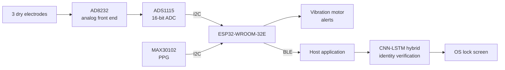
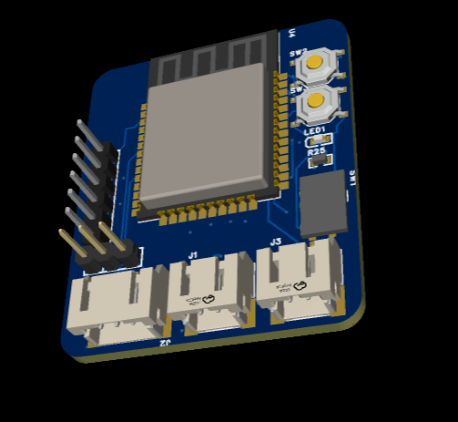
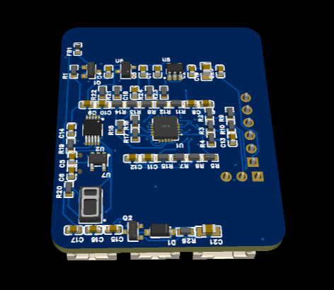
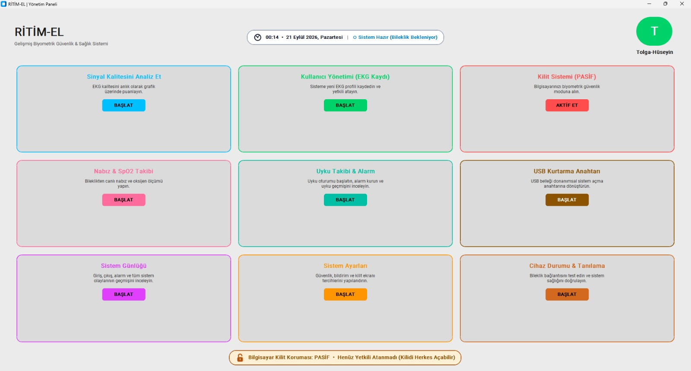
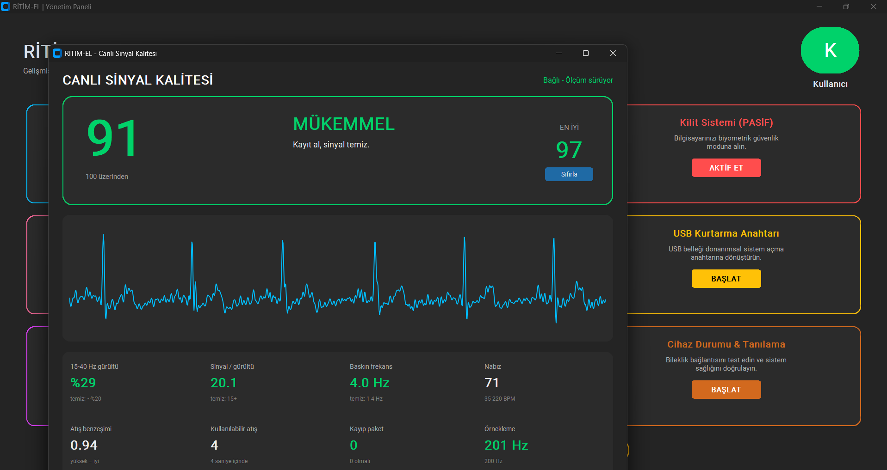

# RİTİM-EL — Wearable ECG/PPG Biometric Authentication

> **Status:** Working end-to-end breadboard prototype — acquisition, verification and
> lock-screen control all functional. Custom PCB v1 is in layout.
> Source code is not public at this stage — available on request.

A wrist-worn device that authenticates a user from their own ECG waveform and keeps the
session alive with continuous on-wrist monitoring. Built end to end: analog front end,
a custom 4-layer PCB design, embedded firmware, a CNN-LSTM identity model, and OS login
integration.

Final-year capstone project at Bartın University, being prepared for submission to the
**TÜBİTAK 2209-A** university student research programme.

---

## Why ECG *and* PPG

Fingerprint and face are clonable — they are surfaces. ECG morphology is a property of the
heart itself, and it is only produced by a living body. That makes it a strong biometric,
but continuous ECG from a single wrist is not physically possible: a valid lead needs
contact from the opposite hand. That constraint shapes the whole architecture into two
layers:

| Layer | Sensor | Role | Cadence |
|---|---|---|---|
| Identity | ECG (AD8232) | Deep biometric verification — accept / reject | At unlock, then periodically or on user interaction |
| Presence | PPG (MAX30102) | Is the band still on the same wrist? No identity claim. | Continuous, millisecond-scale |

Most work in the literature authenticates **once**, at login, and has no answer for the
device-handover problem — someone else sitting down at an unlocked machine. The presence
layer closes that gap: if the band is removed, loosened, or moved to another wrist, the
PPG signal changes, the session is invalidated and the screen locks immediately. The ECG
layer then has to pass again before access is restored.

---

## System architecture

### Signal chain

Skin → dry electrodes → AD8232 instrumentation amplifier with right-leg drive and
integrated filtering → ADS1115 16-bit ADC (I²C) → ESP32 samples at a fixed **250 Hz**
using a hardware timer → BLE → host application → CNN-LSTM inference.

Sampling is driven by a hardware timer rather than a software loop, because jitter in the
sample interval corrupts exactly the morphology features the model depends on. BLE is the
primary link; a wired USB fallback is kept for link-quality problems.

---

## Electrode placement

Three dry electrodes, IEC colour convention:

| Wire | Position | Function |
|---|---|---|
| Yellow (L) | Left wrist, ventral (inner) surface | Active |
| Green | Left wrist, dorsal (outer) surface | Reference / right-leg drive |
| Red (R) | Fingertip of the **opposite** hand | Active |

The yellow/green pair sits on opposite faces of the same wrist; the red electrode is
touched with the free hand only when a verification is due. This closes a lead across the
torso while keeping everything except the momentary finger contact on one wrist.

Measured result on the breadboard prototype: clean signal, noise eliminated, reliable
R-peak detection, and working verification from this placement.

---

## Hardware

**PCB v1** — 4 layers, 36 × 43 mm, components on both faces, designed in EasyEDA.

| Block | Part | Notes |
|---|---|---|
| MCU | ESP32-WROOM-32E-N8 | Soldered module; Wi-Fi + BLE |
| ECG AFE | AD8232ACPZ | Bare IC, single-lead configuration |
| ADC | ADS1115IDGSR | 16-bit, I²C @ 0x48 |
| PPG | MAX30102EFD+T | 1.8 V core, 3.3 V LED rail |
| Power | AP2112K-3.3 / XC6206P182 / LP5907-3.0 | System 3.3 V, 1.8 V, isolated analog 3.0 V |
| Haptics | Low-side N-FET + vibration motor | Alerts and feedback |
| Protection | P-FET reverse polarity, ferrite-isolated analog rail | — |

  
  

The analog supply is derived through a ferrite bead and its own low-noise LDO, kept
separate from the digital rail — ECG amplitudes at the electrode are in the millivolt
range and share a board with a radio.

### Electrode interface

No copper electrode pads on the board itself. All three electrodes break out to
solder/connector points so they can be wired wherever the enclosure needs them, and the
finger electrode gets its own compartment on the top of the case. This keeps electrode
geometry independent of the PCB outline.

---

## Software

### Firmware (ESP32, Arduino-C)

Hardware-timer sampling at 250 Hz, ADS1115 readout over I²C, AD8232 leads-off detection
on `LOD+` / `LOD−`, shutdown control, BLE streaming, haptic feedback.

### Signal processing

Raw ECG → 0.5–40 Hz band-pass filter → baseline correction → R-peak detection → sliding-
window segmentation into ~2 s single-beat segments. The sliding window is also what makes
the dataset large enough to train on.

### Model — CNN-LSTM hybrid

Convolutional layers extract per-beat **morphological** features (QRS width, R-R interval,
wave amplitudes); the recurrent stage models how those features evolve across
**consecutive** beats. Purely convolutional models miss the temporal structure; purely
recurrent models are weaker at morphological feature extraction. The hybrid is the point
of the project.

**Transfer learning, two stages:**

1. **Pre-train** on **PTB-XL** (18,869 records) — teaches general cardiac morphology across
   a wide patient population and a range of rhythm conditions.
2. **Fine-tune** on **ECG-ID** (90 subjects) — CNN layers frozen, LSTM and output layers
   retrained so the model learns person-specific identity patterns on top of the general
   anatomy it already knows. ECG-ID contains recordings of the same subject on different
   days, which is what makes the result meaningful outside a single session.

Evaluation uses **FAR / FRR / EER** rather than plain accuracy, and splits are made at the
*session* level rather than the segment level, to avoid leakage between neighbouring beats
of the same recording.

### Application layer

Background service on the host, shipped as a standalone executable. Lock screen driven by
verification state, with the desktop preserved underneath rather than a kiosk-mode shell
replacement. Windows is implemented and working; Linux and macOS are targeted.

---

## User Interface

The desktop application provides real-time visibility into the verification process. It handles BLE pairing, displays the live ECG stream for signal quality and electrode placement checks, and manages the OS lock-screen state based on the continuous authentication model.

  
  

---

## Data handling

No biometric data leaves the user's machine.

- The enrolled identity profile is stored as an **encrypted feature vector**, not as raw signal.
- Raw ECG lives in a temporary buffer during verification and is discarded immediately after.
- There is no central server anywhere in the flow — nothing to breach, nothing to exfiltrate.

---

## Results

Preliminary study, CNN-LSTM trained on 2,000 patients selected from PTB-XL:

| Metric | Value |
|---|---|
| Identity verification accuracy | **~98%** |
| Target EER | < 10% |
| Pre-training set | PTB-XL — 18,869 records |
| Fine-tuning set | ECG-ID — 90 subjects |

Full FAR / FRR / EER characterisation on the complete PTB-XL set and on hardware-captured
wrist data is in progress.

---

## Roadmap

- [x] Literature review and signal-preprocessing pipeline
- [x] ESP32 firmware, 250 Hz stable sampling
- [x] CNN-LSTM training + transfer learning (PTB-XL → ECG-ID)
- [x] Windows application and lock-screen integration
- [x] **Breadboard prototype working end to end** — acquisition → verification → lock/unlock
- [x] Schematic v1
- [ ] PCB v1 layout and fabrication
- [ ] BLE link and real-time streaming on the custom board
- [ ] Enclosure design
- [ ] Full FAR / FRR / EER evaluation on wrist-captured multi-session data
- [ ] Battery and charging (deferred from v1)

---

## Team

Two-person capstone project at Bartın University, advised by Asst. Prof. Onur Çakırgöz,
being prepared for the TÜBİTAK 2209-A programme.

- **Tolga Karateke** — hardware: analog front end, PCB design, firmware, system integration
- **Hüseyin Konak** — verification software, OS integration, test and performance evaluation

---

## A note on the source

The firmware, model and application code are not published while the project is in
development. The design, architecture and hardware are documented here in full. If you
want to look at the implementation, get in touch.

© 2026 — All rights reserved.
