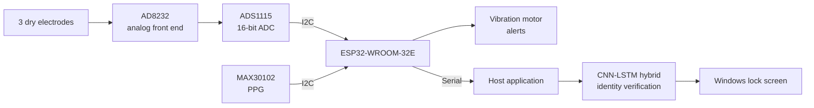
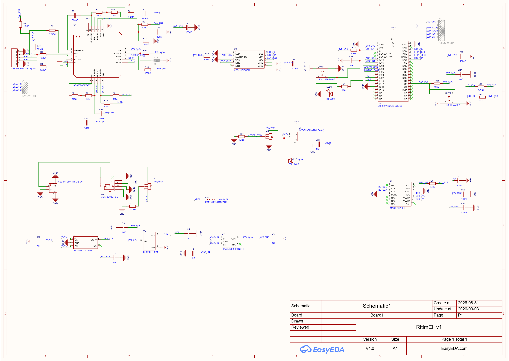

# Ritim El — Wearable ECG/PPG Biometric Authentication

> **Status:** Active development. Firmware and ML pipeline complete; PCB v1 in layout.
> Source code is not public at this stage — available on request.

A wrist-worn device that authenticates a user from their own ECG waveform, then keeps
the session alive with continuous PPG monitoring. Built end to end: analog front end,
custom 4-layer PCB, embedded firmware, deep learning model, and a Windows lock-screen
integration.

---

## Why ECG *and* PPG

ECG is a strong biometric — the waveform morphology is individual and hard to forge —
but continuous ECG from a single wrist is not physically possible: a valid lead needs
contact from the opposite hand. That constraint shapes the whole architecture:

| Stage | Sensor | Role |
|---|---|---|
| Initial unlock | ECG (AD8232) | Identity verification. User touches the finger electrode with the opposite hand. |
| Session hold | PPG (MAX30102) | Continuous on-wrist + liveness detection. No identity claim — it only answers *"is the same living wrist still wearing this?"* |

Removing the band breaks the PPG signal, which invalidates the session and forces
re-authentication. This separation of concerns is the core design decision of the project.

---

## System architecture

### Signal chain

Skin → dry electrodes → AD8232 instrumentation amplifier with right-leg drive and
integrated high-pass / low-pass filtering → ADS1115 16-bit ADC (I²C) → ESP32 samples at
a fixed 250 Hz using a hardware timer → host application → CNN-LSTM inference.

Sampling is driven by a hardware timer rather than a software loop, because jitter in the
sample interval directly corrupts the morphology features the model depends on.

---

## Electrode placement

Three dry electrodes, IEC colour convention:

| Wire | Position | Function |
|---|---|---|
| Yellow (L) | Left wrist, ventral (inner) surface | Active |
| Green | Left wrist, dorsal (outer) surface | Reference / right-leg drive |
| Red (R) | Fingertip of the **opposite** hand | Active |

The yellow/green pair sits on opposite faces of the same wrist; the red electrode is
touched with the free hand only at unlock time. This arrangement closes a lead across
the torso while keeping everything except the momentary finger contact on one wrist.

Measured result: clean signal with low baseline noise and reliable QRS detection —
verification works from this placement.

---

## Hardware

**PCB v1** — 4 layers, 36 × 43 mm, components on both faces, designed in EasyEDA.

| Block | Part | Notes |
|---|---|---|
| MCU | ESP32-WROOM-32E-N8 | Soldered module |
| ECG AFE | AD8232ACPZ | Bare IC, single-lead configuration |
| ADC | ADS1115IDGSR | 16-bit, I²C @ 0x48 |
| PPG | MAX30102EFD+T | 1.8 V core, 3.3 V LED rail |
| Power | AP2112K-3.3 / XC6206P182 / LP5907-3.0 | System 3.3 V, 1.8 V, isolated analog 3.0 V |
| Haptics | Low-side N-FET + vibration motor | Alerts and feedback |
| Protection | P-FET reverse polarity, ferrite-isolated analog rail | — |

  

The analog supply is derived through a ferrite bead and its own low-noise LDO, kept
separate from the digital rail — ECG amplitudes at the electrode are in the millivolt
range and share a board with a Wi-Fi radio.

### Electrode interface

No copper electrode pads on the board itself. All three electrodes break out to
solder/connector points so they can be wired to wherever the enclosure needs them, and
the finger electrode gets its own compartment on the top of the case. This keeps the
electrode geometry independent of the PCB outline.

---

## Software

**Firmware (ESP32, Arduino-C)** — hardware-timer sampling at 250 Hz, ADS1115 readout over
I²C, AD8232 leads-off detection on `LOD+` / `LOD−`, shutdown control, haptic feedback.

**Model (Python / TensorFlow)** — a CNN-LSTM hybrid over segmented, filtered ECG: convolutional
layers extract per-beat morphological features, the recurrent stage models how those
features evolve across consecutive beats. Evaluation uses
**FAR / FRR / EER** rather than plain accuracy, and train/test splits are made at the
*session* level, not the segment level, to avoid leakage from neighbouring beats of the
same recording.

**Application layer** — Windows lock screen driven by verification state, with the
desktop preserved underneath rather than a kiosk-mode shell replacement.

---

## Results

<!-- Fill these in from your evaluation run -->
| Metric | Value |
|---|---|
| EER | _TBD_ |
| FAR @ operating point | _TBD_ |
| FRR @ operating point | _TBD_ |
| Enrolled subjects | _TBD_ |
| Sessions per subject | _TBD_ |

---

## Roadmap

- [x] Signal acquisition validated on breadboard
- [x] ESP32 firmware, 250 Hz stable sampling
- [x] CNN-LSTM training pipeline and evaluation
- [x] Windows lock-screen integration
- [x] Schematic v1
- [ ] PCB v1 layout and fabrication
- [ ] Enclosure design
- [ ] Multi-session data collection across more subjects
- [ ] Battery and charging (deferred from v1)

---

## A note on the source

The firmware, model and application code are not published while the project is in
development. The design, architecture and hardware are documented here in full. If you
want to look at the implementation, get in touch.

© 2026 — All rights reserved.
